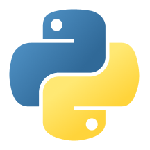

  

  👋 Hi! Ich bin Alexander — gelernter Maler & Beschichtungstechniker, Logistik-Experte und Coder aus Leidenschaft. Ich liebe es, Dinge mit Substanz zu erschaffen, ob aus Holz oder aus Code.
    
  Als Supervisor im Warehouse sorge ich für reibungslose Abläufe. Mein Ziel ist es, diese logische Effizienz aus der Logistik und die Präzision des Handwerks in meine Software-Projekte zu übertragen.
    
  Mein Antrieb? Technik greifbar machen — ob durch ein smartes Home Assistant Setup, ein sauberes Stück Holz aus meiner Werkstatt oder gut strukturierten Code.

###
##  Berufserfahrung & Leidenschaft

<table >
  <tr>
    <td></td>
    <td style="padding-left: 12px;">
      Warehouse Supervisor 
      Logistik & Prozessmanagement
    </td>
  </tr>
</table>

## Preferred Tech Stack

<h3> Frontend & Grundlagen</h3>

  
  
  

<h3> Backend & Smart Home</h3>

  
  

<h3> Dev-Tools & Hobby</h3>

  
  
  

###

##  GitHub Stats

  
  

###

##  SNAKE!

###

##  Contact & Motto

  

   
  <strong>"Vom Pinsel zum Pixel – Logik bleibt Handwerk."</strong>

###
