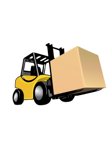

  

  👋 Grias di! 
  Ich bin <strong>Alex</strong> 🇦🇹
    
  Vom <strong>Maler- und Beschichtungstechniker</strong> zum <strong>Logistik-Supervisor</strong> und jetzt auf der Reise in die Welt des <strong>Codings</strong>. 
    
  Ich komme aus dem schönen Kärnten und liebe es, Dinge zu erschaffen – egal ob aus Holz in meiner Werkstatt oder aus Code am Bildschirm. 

---

### Über mich

* **Beruflich:** Aktuell Supervisor im Warehouse-Management. Ich kenne mich mit komplexen Abläufen und Führung aus.
* **Smart Home Enthusiast:** Mein Zuhause läuft auf **Home Assistant** (und wie wir wissen: Ein Smart Home ist niemals "fertig").
* **Maker-Herz:** In meiner Werkstatt werkle ich am liebsten mit Holz, oft zusammen mit meinen zwei Söhnen.
* **Coding-Reise:** Aktuell experimentiere ich mit **HTML & CSS**, um die Logik hinter der Technik zu verstehen.

###

##  Aktuelle Tätigkeit

<table >
  <tr>
    <td></td>
    <td style="padding-left: 12px;">
      Warehouse Supervisor 
      Logistik & Prozessmanagement
    </td>
  </tr>
</table>

###

##  GitHub Stats

  
  
  

###

##  SNAKE!

###

##  Contact & Motto

 

<blockquote align="center">
  <strong>"Vom Pinsel zum Pixel – Logik bleibt Handwerk."</strong>
   
  Ich glaube daran, dass gute Technik wie ein gut verarbeitetes Stück Holz sein sollte: 
  Stabil, funktional und sauber durchdacht.
</blockquote>

###
