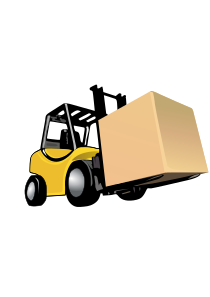

  

  👋 Grias di! 
  Ich bin <strong>Alex</strong> aus Kärnten 🇦🇹  
  Maler-Lehrling, Lagermitarbeiter, Warehouse Supervisor. 
  Seit ein paar Jahren auch Webentwickler.  
  Ich baue Dinge. Mit Holz in der Werkstatt, mit Code am Rechner.

---

### Was ich so mache

* **Warehouse Supervisor** bei KMF/Omya in Villach. Lager, Prozesse, SAP. Und der tägliche Beweis, dass Dokumentation doch wichtig ist.
* **Webentwicklung**: [alexmacht.at](https://alexmacht.at) läuft seit 2024, erste Kundenwebsite ist live. Stack: Next.js, TypeScript, Tailwind CSS.
* **Holzwerkstatt**: Ich baue ohne Zeichnung, aber ich weiß vorher was rauskommt.
* **Smart Home**: Home Assistant, Unifi, Zigbee. Fertig wird es nie. Das ist bekannt und akzeptiert.

###

## Aktuelle Projekte

<table>
  <tr>
    <td><strong><a href="https://alexmacht.at">alexmacht.at</a></strong></td>
    <td>Meine persönliche Brand. Webentwicklung für kleine Betriebe in Kärnten.</td>
    <td>🟢 Live</td>
  </tr>
  <tr>
    <td><strong>scherzer-psychotherapie.at</strong></td>
    <td>Erste Kundenwebsite. Psychotherapie-Praxis aus dem Raum Villach.</td>
    <td>🟢 Live</td>
  </tr>
  <tr>
    <td><strong>PetCard</strong></td>
    <td>Mobile App für Tiergesundheitsdaten. Immer dabei, auch beim fremden Tierarzt.</td>
    <td>🔧 In Entwicklung</td>
  </tr>
</table>

###

## Tech Stack

  
  
  
  
  
  

###

## Aktuelle Tätigkeit

<table>
  <tr>
    <td></td>
    <td style="padding-left: 12px;">
      Warehouse Supervisor 
      KMF / Omya International, Villach
    </td>
  </tr>
</table>

###

## GitHub Stats

  
  

###

## SNAKE!

###

## Contact

<blockquote align="center">
  <strong>"Vom Pinsel zum Pixel. Logik bleibt Handwerk."</strong>
   
  Gute Technik sollte wie ein gut verarbeitetes Stück Holz sein: stabil, funktional, sauber durchdacht.
</blockquote>

###
